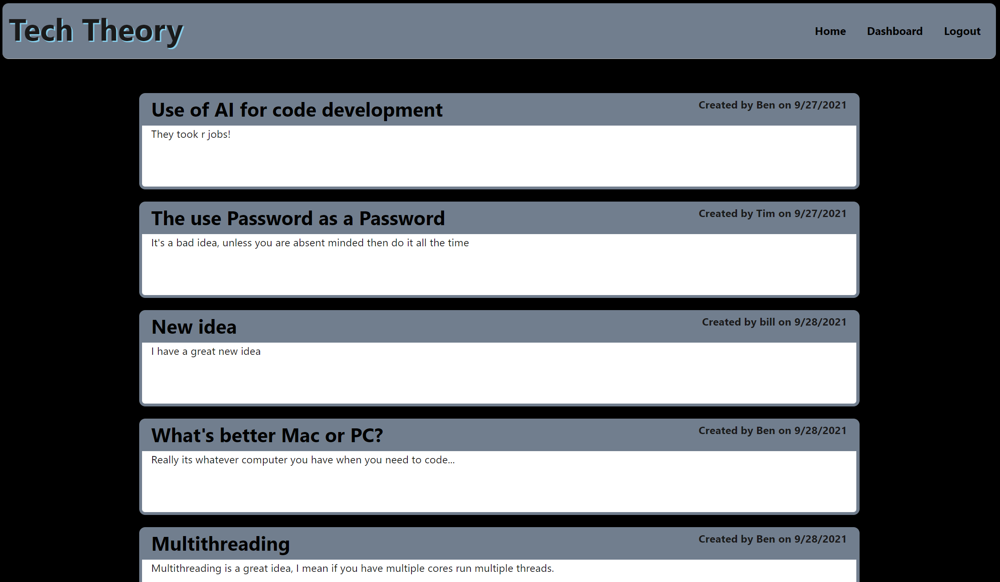

# Tech-Theory
A blog site where developers can publish blog posts and comment on other developer's posts as well.

## Table of Contents

1. [Description](#description)

1. [Technologies and Skills](#technologies)

1. [Screenshot](#screenshot)

1. [Link to Deployed App](#sample)

1. [Installation](#installation)

1. [Use](#usage)

1. [License](#license)

1. [Collaborators](#collaborators)

1. [Contact](#contact)

## Description

* This application allows you to login and publish blog posts, thoughts and opinions.  This app follows the MVC paradigm and uses Handlebars, Sequelize and express-session.

## Technologies and Skills Demonstrated

* MVC paradigm
* Handlebars HTML & CSS
* MySQL and Sequelize
* express-session
* bcrypt

## Screenshot

## Visit the App deployed on Heroku

* [Link to Deployed Application](https://arcane-forest-46584.herokuapp.com/)

## Installation

* Run the following to install dependancies, the following will be installed, express, mysql2, dotenv, bcrypt, sequelize 
, handlebars
> npm install

* A .env file with the following is required

> DB_NAME

> DB_PASSWORD

> DB_USER

> DB_SESSPASS

## Usage

* The repo can be forked and then the required modules installed as per above.  The application is run from the command line by entering "node server.js"

## License

- MIT

## Collaborators

* Ben Slinde - sole author

## Contact me

* If you would like, you can connect with me thru my github profile [Github Profile](https://github.com/stevenslade)
